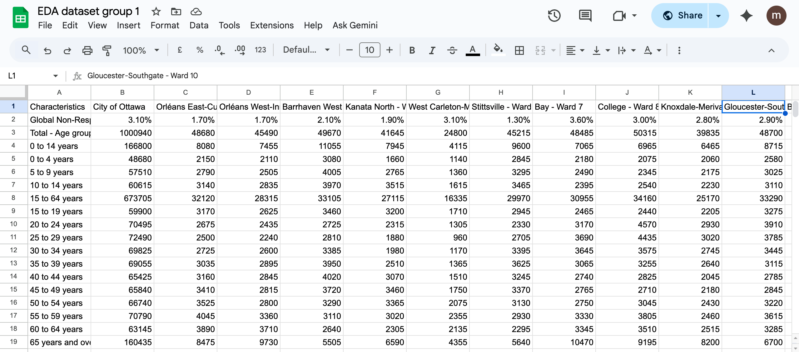
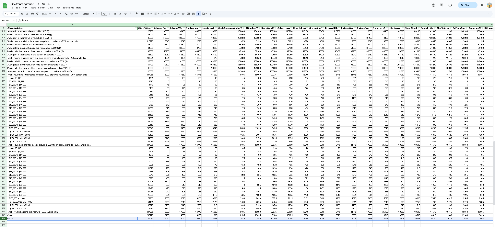

**November 9, 2025** 
**MPAD2003A Introductory Data Storytelling** 
**Mariia Bondar** 
**Taha Saffih** 
**Yusra Ghani** 
**Beracah Okere** 
**Presented to Jean-Sébastien Marier** 

# Exploratory Data Analysis (EDA) & Pitch

## Foreword

For this assignment, you must extract data from a dataset provided by the instructor. You must then clean and analyze the data, create exploratory charts/visualizations, and find a potential story idea. Your assignment must clearly detail your process. You are expected to write about 1500-2000 words, and to include several screen captures showing the different steps you went through. Your assignment must be written with the Markdown format and submitted on GitHub Classroom.

I have been assigning different versions of this project to my digital journalism and data storytelling students for a few years now. Its structure was inspired by the main sections/chapters of [*The Data Journalism Handbook*](https://datajournalism.com/read/handbook/one/). This version was further inspired by the [Key Capabilities in Data Science](https://extendedlearning.ubc.ca/programs/key-capabilities-data-science) program offered by the University of British Columbia (UBC).

**Here are some useful resources for this assignment:**

* [GitHub's *Basic writing and formatting syntax* page](https://docs.github.com/en/get-started/writing-on-github/getting-started-with-writing-and-formatting-on-github/basic-writing-and-formatting-syntax)
* [The template repository for this assignment in case you delete something by mistake](https://github.com/jsmarier/jou4100_jou4500_mpad2003_project2_template)

## 1. Introduction

In this document, we are going to complete our Exploratory Data Analysis and Pitch assignment based on the 2021 Long Form Census - Ward Data dataset collected by Statistics Canada and published on the City of Ottawa’s open data portal on November 28, 2023. We will be analyzing demographic data of 25% of households in Ottawa.  

The 2021 long-form Census questionnaire was distributed to 25% of all households in Ottawa. The data was collected by Statistics Canada. The dataset covers all 24 electoral districts (wards) within Ottawa and the City of Ottawa. It includes various categories such as marital status, religion, place of birth, among others, along with their totals. The dataset contains 2,602 rows. It uses discrete variables (Statistics: Power from Data!, Section 4.2). 

[*The original dataset on Open Ottawa*](https://open.ottawa.ca/datasets/ottawa::2021-long-form-census-ward-data/explore). 

[*CSV version from the GitHub portal*](https://raw.githubusercontent.com/jsmarier/files-for-course-assignments/refs/heads/main/2021_Long_Form_Census_-_Ward_Data.csv). 

The main sections of this assignment are importing, analyzing, and cleaning data; conducting an exploratory data analysis; finding a potential story; and researching other sources to tell it better. 

## 2. Getting Data

To import data into Google Sheets, we copied the URL of the dataset. Then, we selected an empty cell at the beginning of the spreadsheet (e.g., cell A1) and entered the formula  ` =IMPORTDATA("URL") ` (Marier, 2021, 0:46). We replaced "URL" with the copied URL, including the quotation marks. Finally, we pressed Enter to import the dataset.   

 
*Figure 1: The "Import file" prompt on Google Sheets.*

[*Public link to our Google Sheets*](https://docs.google.com/spreadsheets/d/1lZDdngeOup1NO11wTbPw5DKi6v85-Oq4eJjfzvdI-5g/edit?usp=sharing). 
 

General observations regarding the dataset: 

* 26 columns 
* 2,602 rows 
* Discrete variables 
* Demographic characteristics 

The dataset appears to be somewhat unclean. It includes the City of Ottawa, represented by the mayor, as well as 24 wards represented by their respective councillors. This suggests that the values for the City of Ottawa are regarded as the sum of its individual wards' values. We have created a separate column using the formula ` = SUM(C3:Z3) ` to calculate the total for the wards' values in the "Total - Age Groups of the Population - 25% Sample Data." According to this calculation, the City of Ottawa should have 1,000,940 people in that category ; however, our sum shows 1,000,930, leading to a discrepancy of 10 people. This difference appears in several of the initial columns, ranging from 5 to 15. Clarification is needed as to why there is a discrepancy, considering that the City of Ottawa is composed of 24 wards. 

  

* Column B (City of Ottawa) displays either total or average figures derived from the 24 wards across all other columns. These are discrete data points representing the number of people in specific categories, such as the First Nations population within the City of Ottawa. 

* Column C (Ward 1) indicates the number or average number of individuals in each category for residents of Orléans East-Cumberland – Ward 1. It is a discrete data.  

* Similarly, Column Z (Ward 24) shows the number or average number of individuals in each category for residents of Barrhaven East – Ward 24. It is a discrete data.  

 

## 3. Understanding Data

### 3.1. VIMO Analysis

Use three hashtag symbols (`###`) to create a level 3 heading like this one. Please follow this template when it comes to level 1 and level 2 headings. However, you can use level 3 headings as you see fit.

Support your claims by citing relevant sources. Please follow [APA guidelines for in-text citations](https://apastyle.apa.org/style-grammar-guidelines/citations).

**For example:**

As Cairo (2016) argues, a data visualization should be truthful...

### 3.2. Cleaning Data

Using the filter tool, several rows that only had zeroes as part of each data entry were filtered out.   

Removing rows that didn’t directly relate to our story.  

Using find and replace tool to mass delete unneeded stuff. By finding entire categories and replacing them with blank spaces, we effectively mass deleted entire rows at once 

Rows were frozen so we could analyze the full length of them, ensuring an easier way to view the rows without having to zoom in/out of the spreadsheets 

The top columns which displayed the titles were also frozen to ensure an easier viewing experience, so we don't get lost when scrolling down the spreadsheet.  

This is the screenshot of the edited, cleaned up datasheet whereas the original, unedited version had over 2,600 rows.  

The only time(s) functions were used was to sus out any numerical discrepancies like using the “SUM” function to ensure the accuracy of the data.  Since there were some cells that had the sums of the rows already, we used that function and found some numerical inaccuracies which we dealt with accordingly.  

### 3.3. Exploratory Data Analysis (EDA)

**This section should include a screen capture of your pivot table, like so:**

 
Figure 2: This pivot table shows the pivot table shrunk down into two values, that being the positions of the players that scored and the amount of scores from said position followed by the grand total at the bottom. This is done to 
further simplify the data in such a way that there is very little room left for ambiguity.  

**This section should also include a screen capture of your exploratory chart, like so:**

 
Figure 3: This exploratory chart shows more broader statistics of each player. By using clustered bar graphs, it makes it easier to make out things that are easier to imagine. Things like height for example being the highest value for
each person since it is in centimeters. Therefore, it's not being obfuscated by the other values closer to the bottom. 

## 4. Potential Story

One potential story emerging from this dataset hones in on the disparity between homeowners and renters across Ottawa's wards. This illustrates a contrast that illuminates much more than simple differences in housing status. By analyzing
the ownership and rental rates, we can identify several patterns of income inequality, generational wealth gaps, and the braoder impact of housing affordability in a post-pandemic economy. Like how wards with higher amounts of homeowners
my correlate with older populations, higher household incomes, and greater economic stability, whereas wards with a lot more renters may reflect younger residents, more cultural diversity, less cash flow, and more economic instability. By delving into how the distributions vary geographically across Ottawa, we can deduce how access to stable housing influences everything from political engagement to mental well-being. In essence, this data story could help visualize the "two Ottawas". One of ownership and one of tenancy, overlap or diverge, and what that means for the city’s future growth and equity.
## 5. Conclusion

We believe cleaning the data and developing the story was the hardest part of this assignment for us. It was confusing since all the different characteristics were in rows, so analyzing them in a pivot table would require us to create new spreadsheets with just one row. We also struggled because our idea was too broad (how the household market changed due to COVID-19), and it would require a better financial understanding than we currently have. 

  

The best parts were using the knowledge we gained—such as inserting the dataset and searching for specific items within it. It was also fun to identify data types. Tasks that required conceptual understanding worked well, but the hands-on experiences lacked practice or the necessary knowledge. 

  

We should have come up with an easier story and reviewed it together during the initial stage of the assignment. People who are more confident in their technical skills and data operations should have handled those parts, while those who are less confident should have taken on the writing portions. We had to start the project as soon as it was shared with us to allow more time for changes and necessary communication. 

## 6. References

  Gray, J. (Jonathan A., Bounegru, L., Chambers, L., Open Knowledge Foundation, & European Journalism Centre. (2012). *The data journalism handbook* (1st ed.). O’Reilly.
  
  Marier, Jean-Sébastien. (2021, October 19). *Basic Data Analysis Techniques* [Video]. YouTube. https://youtu.be/fuJA8cHN1jc?si=7s_ie0Llh9v79N3q  
  
  Statistics Canada. https://www150.statcan.gc.ca/n1/edu/power-pouvoir/ch8/5214817-eng.htm 